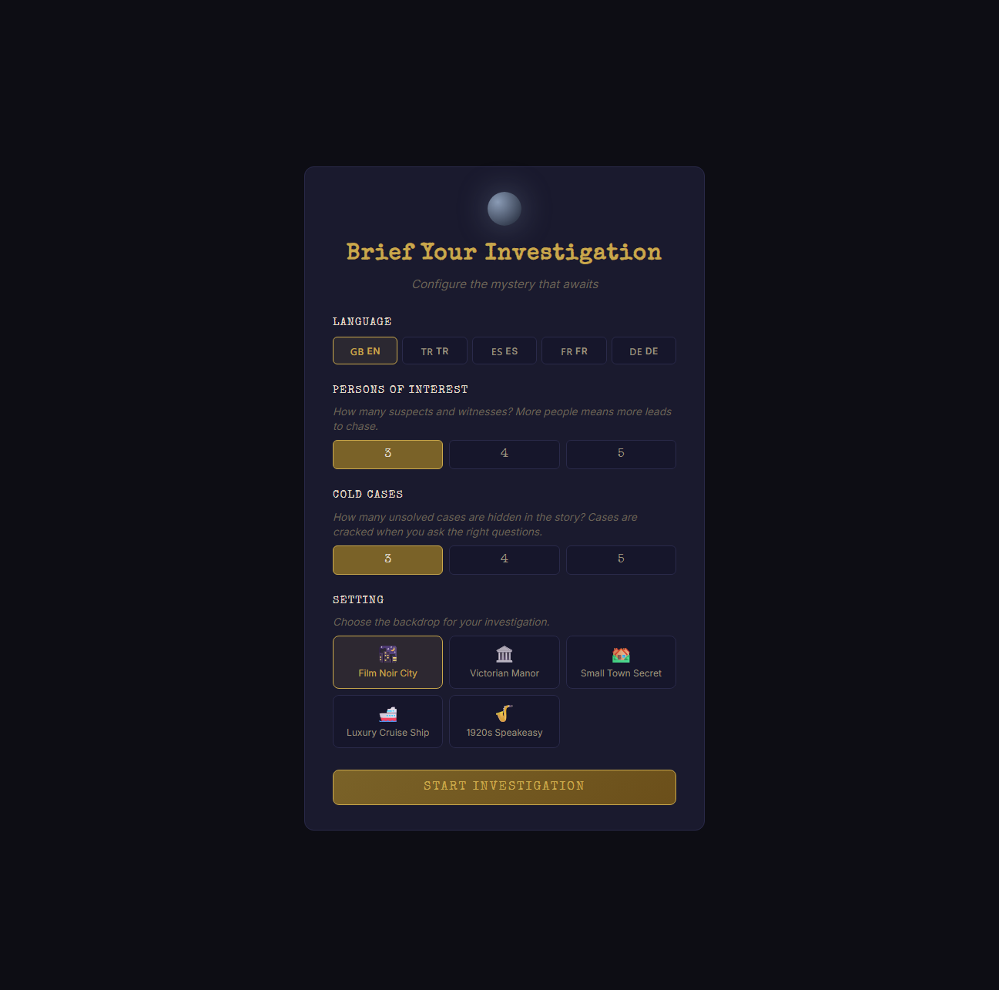
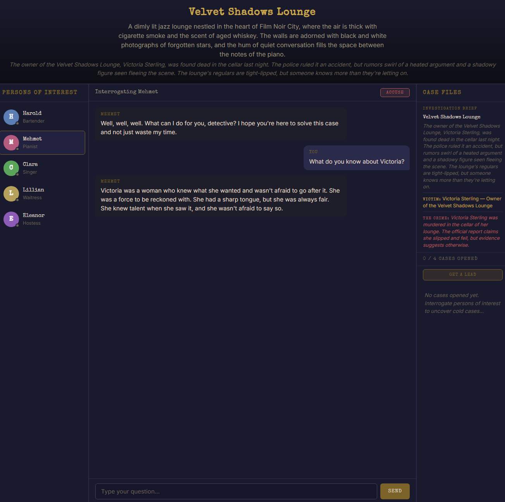

# Shadows & Suspects

An AI-powered detective interrogation game where you question suspects, uncover cold cases, and identify the killer. Every mystery is procedurally generated by **Mistral AI** — no two playthroughs are the same.

## Screenshots

| Setup | Interrogation |
|:-----:|:-------------:|
|  |  |

## How It Works

You play as a detective investigating a crime. The game generates a cast of suspects, a victim, a timeline of events, and hidden cases to solve. You interrogate persons of interest through natural conversation, piece together clues, and ultimately accuse the guilty party.

**Two-Agent AI Architecture** — Each NPC response goes through two AI passes:
1. **Reasoning Agent** — Analyzes your question against the NPC's knowledge base, decides what they should/shouldn't reveal, and tracks mood and quest triggers
2. **Dialogue Agent** — Transforms the reasoning into natural, in-character spoken dialogue

This prevents NPCs from contradicting themselves or leaking information they shouldn't know.

## Features

- **Procedural mysteries** — Setting, NPCs, victim, timeline, quests, and the guilty party are all generated fresh each game
- **Interrogation-based gameplay** — Ask questions freely in natural language; NPCs respond in character
- **Cold cases** — Hidden sub-investigations unlocked by asking the right questions to the right people
- **Accuse mechanic** — One chance to formally accuse a suspect; get it wrong and it's game over
- **Lead system** — Stuck? Request a hint pointing you toward an undiscovered case
- **NPC mood tracking** — Push too hard and suspects get hostile; build rapport and they open up
- **5 themed settings** — Film Noir City, Victorian Manor, Small Town, Luxury Cruise Ship, 1920s Speakeasy
- **5 languages** — English, Turkish, Spanish, French, German

## Tech Stack

| Layer | Tech |
|-------|------|
| Backend | Node.js + Express |
| AI | Mistral AI (`mistral-small-latest`) |
| Frontend | Vanilla HTML/CSS/JS |
| Styling | Custom dark theme with CSS variables |

## Getting Started

### Prerequisites

- [Node.js](https://nodejs.org/) (v18+)
- A [Mistral AI](https://console.mistral.ai/) API key

### Setup

```bash
# Clone the repository
git clone https://github.com/emirtuncer/shadows-and-suspects.git
cd shadows-and-suspects

# Install dependencies
npm install

# Create .env file from example
cp .env.example .env
# Then add your Mistral API key to .env

# Start the server
npm start
```

Open [http://localhost:3000](http://localhost:3000) in your browser.

## Project Structure

```
├── server.js              # Express server, Mistral AI integration, game logic
├── public/
│   ├── index.html         # Single-page game UI
│   ├── css/
│   │   └── style.css      # Dark detective theme
│   └── js/
│       ├── app.js          # Entry point, game initialization
│       ├── scenario.js     # Scenario state management
│       ├── dialogue.js     # Chat/interrogation logic
│       ├── quests.js       # Case file tracking & rendering
│       ├── ui.js           # UI rendering, modals, toasts
│       └── translations.js # i18n strings (EN, TR, ES, FR, DE)
├── package.json
└── .env                   # MISTRAL_API_KEY (not committed)
```

## How to Play

1. **Configure** — Pick your language, number of suspects, number of cold cases, and a setting
2. **Read the brief** — Note the victim, the crime, and who the persons of interest are
3. **Interrogate** — Click an NPC and ask questions in natural language
4. **Uncover cases** — Asking about the right topics opens cold cases in the Case Files panel
5. **Follow leads** — Each case has steps involving different NPCs; follow them to close cases
6. **Accuse** — When you think you know who did it, hit the Accuse button (you only get one shot)
7. **Get a confession** — If you accuse correctly, press the suspect with evidence to extract a confession

## API Endpoints

| Method | Endpoint | Description |
|--------|----------|-------------|
| `POST` | `/api/scenario/generate` | Generate a new mystery scenario |
| `POST` | `/api/dialogue/send` | Send a message to an NPC (two-agent flow) |
| `POST` | `/api/accuse` | Formally accuse an NPC |
| `POST` | `/api/hint` | Get a hint about an undiscovered case |

## License

ISC
